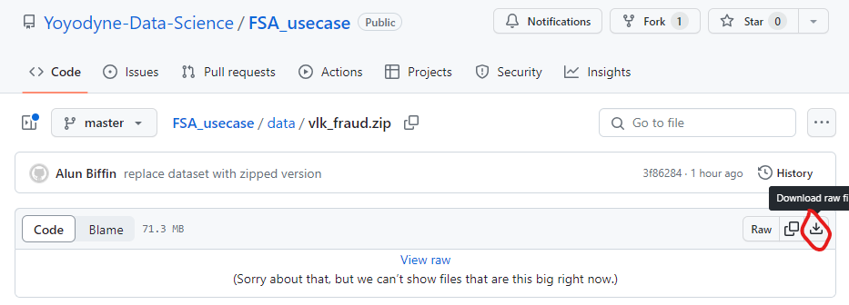

# Data Science hiring use case @ Van Lanschot Kempen

### Client Monitoring Analytics & Anomaly Detection

Fraud detection is considered an archetypal application of machine learning within the banking sector. However, whilst
the internet is littered with jupyter notebooks and blog posts tackling the problem as one of imbalanced
classification, in real-life applications financial institutions detecting fraud often do not have the luxury of
labelled data. The reason for this is partly practical – it can be time consuming even for a domain expert to label a
transaction as fraudulent or legitimate – but also of a more fundamental kind – fraudsters are constantly adapting
their behaviour so as to avoid detection, meaning that a model trained on yesterday’s fraudulent activities may not be
sufficient to detect today’s fraud.

### Usecase

Van Lanschot Kempen would like the students to build an anomaly detection algorithm to detect suspicious transactions in
an anonymized credit card transaction dataset. Assessment of the applicant's work will consider the following elements:

(1) Guided by their models, the applicant will choose the 100 most suspicious transactions within the dataset and these will be
compared with the true labels to calculate a precision score

(2) The applicant will include steps taken to validate the model performance, set up code for deployment, and productionizing the model.

(3) The applicant will prepare a short presentation describing their methodology for anomaly detection. Presentations
highlighting novel approaches and/or attempts to visualize anomalies.

### The Dataset

The dataset is located in the `/data/` folder of this repo. It consists of 284,807 transactions, each of these
transactions is associated with a euro value ('Amount') and a unique ID ('Transaction_ID'). Each transaction is further
characterized by 28 features, labelled X01-X28. No data cleaning is required of this dataset before starting your
analysis.

Download the zipped dataset from the repo by navigating to it then clicking the "Download raw file" button as shown below:

then simply unzip the file on your laptop.

### Your Submission

Once you have your list of 100 transactions, rank them from 1 to 100 (where 1 is the transaction most likely to be
fraudulent (i.e. is the biggest anomaly)), save this as a csv with the file name `team_<your-team-name>.csv` and send it along with your code to
`a.ramamurthy@vanlanschotkempen.com`. This file should only have two columns; "Rank" and "Transaction_ID"
**any other format will not be accepted by the scoring function**. Please see the example file in the `/submission/` folder
if you are unsure about how your submission should be formatted.

### Tips

- Note that the level of contamination (i.e. proportion of transactions which are fraudulent) in datasets such as this
  is very small, around the 0.1% level.
- If your dataset is too large to visualize, you can try picking out the transactions you are most confident are
  anomalies and label them '1', then sample from the remaining transactions and label them '0'. Plotting both these
  populations might give you away to visualize anomalous transactions.
